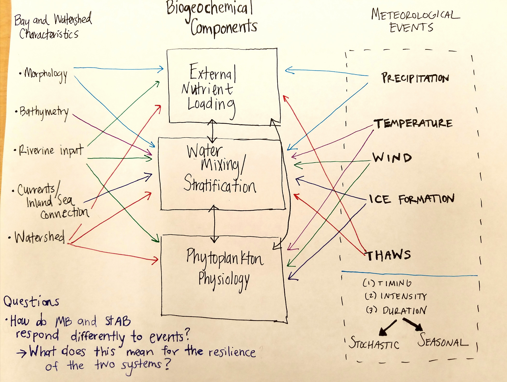
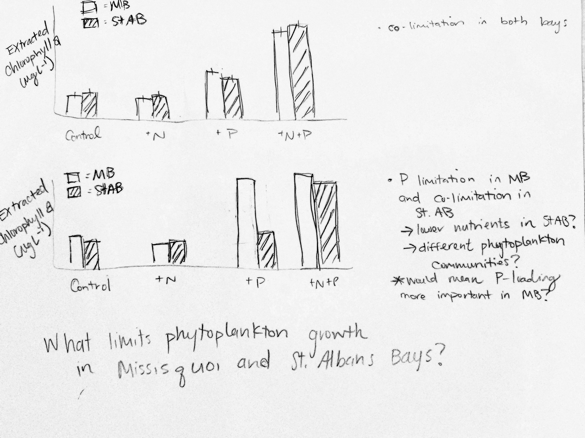

   
1) CONCEPTUAL DIAGRAM: I am studying the harmful cyanobacteria blooms in two shallow embayments in Lake Champlain (Missisquoi Bay and Saint Albans Bay). The different BAY AND WATERSHED CHARACTERTISTICS make the BIOGEOCHEMICAL COMPONENTS unique in the two bays and my PhD thesis will specifically investigate how METEOROLOGICAL EVENTS also affect the BIOGEOCHEMICAL COMPONENTS. Guiding research questions are how these two bays respond differently to events (either stochastic or seasonal) and what does the response mean for the resilience of the two systems? 

 

2) EARLY GRAPH: A very important first step in better understanding the cyanobacteria blooms in these two embayments is understanding what nutrient is limiting phytoplankton growth. To further investigate this I will conduct incubations where water from each bay is collected and four treatments are created by spiking the water with nitrogen (+N), phosphorus (+P), both +N and +P, and an unmanipulated ("control") treatment where no nutrients are added. There are multiple possible results; two results are depicted in the figure above. First, there is nutrient co-limitation in both bays and second that phytoplankton growth is limited by only phosphorus in Missisquoi Bay and co-limited by both nitrogen and phosphorus in Saint Albans Bay. These experiments will be repeated multiple times throughout the spring and summer to better understand nutrient dynamics in the two systems changes seasonally. If the two bays exhibit different growth limiting nutrients this has implications for policy development for their watersheds and help us better understand how to limit harmful cyanobacterial blooms. 