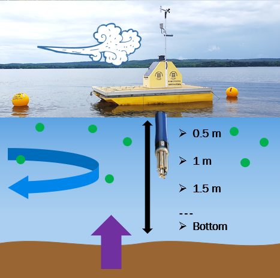

#Background information about the data we will explore with the ` Openair` package: 
<br/>

###I'm studying Lake Champlain because of the severe cyanobacteria blooms. Below is a picture from Missisquoi Bay in 2015 - 
<br/>


<br/>

###To capture bloom dynamics, we have high-frequency buoys moored in Lake Champlain durng the summer months -  
<br/>

<br/>
<br/>
<br/>
<br/>

###Here's a map of the 3 buoy locations. Today we will look at the data from Missisquoi Bay (MB) - 
<br/>

<br/>

###Helpful links 
1. [Openair package info](https://cran.r-project.org/web/packages/openair/openair.pdf)
2. [Plotting with openair (RPubs)](https://rpubs.com/NateByers/Openair)
<br/> 

#Now for the R code: 
```{r}
# Using the open air package for plotting time series 
# 24 April 2018 
# WGB 

# Before we start: 
# Made to analyze air pollution so "pollutant = " parameter we are interested in 
# Good for time series - specifically high-frequency meteorological and water quality data 
# ~40 functions within this package and I will go over using 4 plotting ones! 

# Data
# we will look at surface water parameters and meterological station data: 
# (1) water temperature
# (2) relative amount of chlorophyll (all phytoplankton)
# (3) relative amount of phycocyanin (cyanobacteria only)
# (4) wind speed and direction

# Plots we will make/exploring we will do
# summaryPlot: getting to know your dataset 
# windRose: for wind speed and direction
# timePlot: multiple line graphs for time series (before I knew about patchwork...)
# calendarPlot: calendar days with wind direction and intensity


# Preliminaries 
library(openair)
library(dplyr)


# load the dataset 
dbBuoy <- read.csv("HF_MB_forOpenAir.csv")
# need date and time in the correct format 
dbBuoy$date <- as.POSIXct(strptime(dbBuoy$timestamp,format = "%m/%d/%Y %H:%M", tz = "Etc/GMT-4"))

# summaryPlot
# making a summary plot to see days missing data, distribution of the data, and stats 
summaryPlot(select(dbBuoy, date, windSpeed, CHL_CONC, PC_RFU, wTEMP))
# can change the time period of the stats to "months" 
summaryPlot(select(dbBuoy, date, windSpeed, CHL_CONC, PC_RFU, wTEMP), period = "months")
# can change what values the graph displays: avg.time = "sec", "hour", "day" (default), "week", "month", "quarter", "year", or "2 month" etc. 
summaryPlot(select(dbBuoy, date, windSpeed, CHL_CONC, PC_RFU, wTEMP), period = "months", avg.time="week")


# windRose 
# can see the proportion of wind that was blowing in a certain direction for the dataset 
windRose(dbBuoy, ws="windSpeed", wd="windDir")
# can split it up by season and add "pollution" to see how the wind direction correlated to a parameter you're measuring
pollutionRose(dbBuoy, ws="windSpeed", wd="windDir", pollutant="PC_RFU", type="season")


# timePlot 
# first with different scales 
timePlot(dbBuoy,pollutant=c("wTEMP", "PC_RFU", "CHL_CONC"))
# all on one plot 
timePlot(dbBuoy,pollutant=c("wTEMP", "PC_RFU", "CHL_CONC"), group = TRUE)
# have different scales for y axis
timePlot(dbBuoy,  pollutant=c("wTEMP","PC_RFU", "CHL_CONC"), y.relation="free")
# get a daily average 
timePlot(dbBuoy,  pollutant=c("wTEMP", "PC_RFU", "CHL_CONC"), avg.time="day", y.relation="free")
# add in names and reference line 
timePlot(dbBuoy,  pollutant=c("wTEMP", "PC_RFU", "CHL_CONC"), y.relation="free", ref.y = list(h = 8, lty = 5), name.pol = c("water temp (C)", "PC (RFU)", "Chl (ug/L)"))


# calendarPlot
dbBuoy <- rename(dbBuoy,wd = windDir,  ws = windSpeed)
# with the default colors 
calendarPlot(dbBuoy, pollutant = "PC_RFU")
# customizing the colors and adding in wind vectors 
calendarPlot(dbBuoy, pollutant = "PC_RFU", annotate = "ws", cols = c("white", "dodgerblue", "dodgerblue3", "dodgerblue4"))
# or can just look at the wind speed and direction in one plot 
calendarPlot(dbBuoy, pollutant = "ws", annotate = "wd")

```

